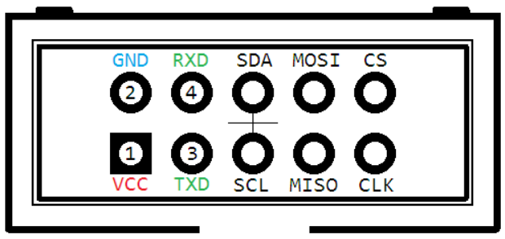

# Arduino Day 2018 #

Кодът за моят worshop за Arduino day 2018, организиран в Пловдив, България.

## Изисквания ##
* [ESP8266-EVB](https://www.olimex.com/Products/IoT/ESP8266-EVB/open-source-hardware)
* [USB-Serial-Cable-F](https://www.olimex.com/Products/Components/Cables/USB-Serial-Cable/USB-Serial-Cable-F/)
* [Държач за батерии](https://vikiwat.com/product/19801/battery-holder-aax2.en.html)
* Зарядно за ESP-то
* Две AA батерии
* Светодиод
* Малко жички
* Отвертка
* [Arduino IDE](https://www.arduino.cc/en/Main/Software)

## Настройка на Arduino IDE ##
1. Стартирайте Arduino IDE и отворете прозорецa с настройки
2. Добавете `http://arduino.esp8266.com/stable/package_esp8266com_index.json` мениджърa за допълнителни платки
3. Инсталирайте пакетa `esp8266` от менюто `Tools > Board`
4. Инсталирайте aREST и aREST_UI
5. Настройте платката:
  * Board: `Generic ESP8266 Module`
  * Flash Mode: `QIO`
  * Flash Size: `2M (1M SPIFFS)`
  * Upload Speed: `57600`

## Свързване на платката към компютър ##

1. Свържете `синята` жичка на серииния кабел към пин `2` на платката
2. Свържете `червената` жичка към пин `4`
3. Свържете зелената жичка към пин `3`
5. Свържете кабелa към USB някой USB порт на компютъра

## Зареждане на програмата ##
1. Включете зарядното устройство към електрическата мрежа
2. Задръжте белия бутон на платката
3. Без да пускате бутонът, включете платката към зарядното
4. Пуснете бутонa
5. Отворете файла `relay.ino` в Arduino IDE
6. Направете нужните промени по кода
7. Проверете за грешки, като натиснете бутона `Verify`
8. Заредете програмта, като натиснете бутона `Upload`

## Свързване на светодиода към ESP8266-EVB ##
1. Вкарайте батериите в държача
2. Свържете `дългото` краче на диода към `червената` жичка на държача
3. Свържете `черната` жичка на държача към `лявата` клема на релето
4. свържете `късто` краче на светодиода към `средният` конектор на релето
